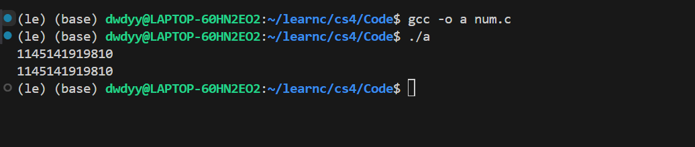
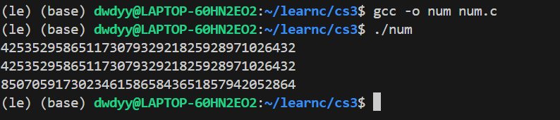
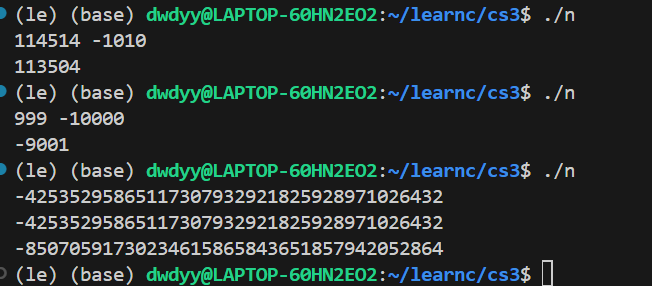
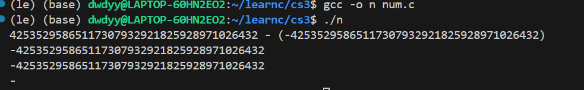
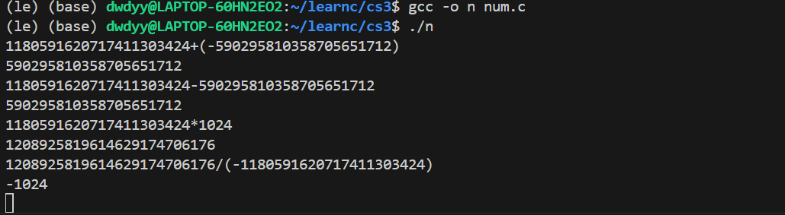

## Part 1 理解大数运算

>为什么要使用字符数组来表示大数？

整数类型范围有限,字符数组可以储存每一位数，手动模拟运算

> 如何处理大数运算中的进位和借位问题？

类比手算数，从低位向高位运算，进位/错位时往高位打个tag,表示借或加1

> 如何处理负数？

新建一个符号位储存正负

如果运算时符号不同则变为相同 $a + b = a - (-b)$   

都是负号可以提出来 $a+b = -(-a + -b)$

只用支持两个正数相加和较大正数减较小正数就行

## Part 2 实现

#### Step 1 

我使用 $struct$ 储存大整数

```c
typedef struct Bigint{ 
    char num[N];
    int size ; // 长度
    int less0; // 正负
}Bigint;
```

下面是一些基本功能函数

```c
void swap(char *a,char *b){char tmp = *a;*a = *b;*b = tmp;}//交换两个char
int max(int a, int b) {  return (a > b) ? a : b;  }  // 去max
void init(Bigint *a){// 初始化
    a->size = 0;
    memset(a->num,'0',sizeof a->num);
}
void reverse(Bigint *a){//翻转一个Bigint
    for(int i=0;i<a->size/2;i++){
        swap(&a->num[i],&a->num[a->size-i-1]);
    }
}
Bigint inv(Bigint a){ // 取负号
    a.less0 ^=1;
    return a;
}
void solve0(Bigint *c){ // 处理前导0
    while(c.size&&c.num[c.size-1] == '0' ) c.size --;
}
char read(Bigint*a){ // 输入大整数并返回最后读的字符

    char x=' ';
    while(x<'0'||  x>'9') x = getchar(); //出去干扰项
    while(x>='0' && x<='9'){
        a->num[a->size++] = x;
        x=getchar();
    }
    reverse(a);// 翻转一下
    return x;
}
void print(Bigint *b){// 输出
    for(int i=b->size-1;i>=0;i--) printf("%c",b->num[i]);
}
void solve0(Bigint *c){//处理前导0
    while(c->size&&c->num[c->size-1] == '0' ) c->size --;
    if(c->size==0) c->less0 = false;
}
```

我们测试一下存储是否有问题

```c
int main(){
    Bigint a;
    read(&a);
    print(&a);
}
```



#### Step 2

加法比较容易，模拟一下进位就可以了,但是需要处理一下前导0的问题

```c
Bigint Add(Bigint a,Bigint b){
    Bigint c;
    init(&c);
    c.size = max(a.size , b.size) + 1;
    // 每一位计算
    for(int i=0;i<c.size;i++)
    c.num[i] = a.num[i] + b.num[i] -'0';
    // 处理进位
    for(int i=0;i<c.size;i++)
    if(c.num[i]>'9'){
        c.num[i+1] += 1;
        c.num[i] -= 10;
    }
    // 处理前导0
    while(c.size&&c.num[c.size-1] == '0' ) c.size --;
    return c;
}
```

测试一下加法

```c
int main(){
    Bigint a,b,c;init(&a);init(&b);init(&c);
    read(&a);read(&b);
    c = Add(a,b);
    print(&c);
    printf("\n");
}
```



#### Step 3

先考虑加法怎么做

分类讨论一下

-  $a$ , $b$ 均负 $a+b =  -((-a) + (-b))$ 变为正数加法
- 一负一正, $a+b = (-a) + b = b -(-a)$ 变为两个正数减法
- 均正已经实现了

```c
  if(a.less0 && b.less0){
        // a<0 && b <0 
        //- (-a) + (-b)
        Bigint c = Add(inv(a),inv(b));
        c.less0^=1;
        return c;
    }else if(a.less0) {
            // a<0 : b - (-a)
            Bigint c = Del(b,inv(a));
            return c;
        }
    else if(b.less0){// b<0
            Bigint c = Del(a,inv(b));
            return c;
    }
```

考虑减法 $a-b$

- $a<0$   $a-b = (-(-a + b))$ 
- $a >0,b< 0$    $a-b = a +(-b)$ 变为正数加法

所以我们只需实现正数减法即可 

再次之前我们需要判断ab大小（inv是取负号）

```c
bool Check_le(Bigint a,Bigint b){// 判断 a < b
    int flag = 0,ans = 0;
    if(a.less0 && b.less0) {
        return Check_le(inv(b),inv(a));
    }
    else if(a.less0) return 1;
    else if(b.less0) return 0;
    if(a.size !=b.size) return a.size < b.size;
    for(int i=a.size-1;i>=0;i--){
        if(a.num[i] != b.num[i])
        return a.num[i] < b.num[i];
    }
    return false;
}
```

根据上面讨论编写并不困难（inv是取负号）

```c
Bigint Add(Bigint a,Bigint b){  // 实现加法
    if(a.less0 && b.less0){
        // a<0 && b <0 
        //- (-a) + (-b)
        Bigint c = Add(inv(a),inv(b));
        c.less0^=1;
        return c;
    }else if(a.less0) {
            // a<0 : b - (-a)
            Bigint c = Del(b,inv(a));
            return c;
        }
    else if(b.less0){// b<0
            Bigint c = Del(a,inv(b));
            return c;
    }
    Bigint c;
    init(&c);
    c.size = max(a.size , b.size) + 1;
    // 每一位计算
    for(int i=0;i<c.size;i++)
    c.num[i] = a.num[i] + b.num[i] -'0';
    // 处理进位
    for(int i=0;i<c.size;i++)
    if(c.num[i]>'9'){
        c.num[i+1] += 1;
        c.num[i] -= 10;
    }
    // 处理前导0
    solve0(&c);
    return c;
}
```

我们再实现减法

```c
Bigint Del(Bigint a,Bigint b){
    if(a.less0)return inv(Add(inv(a),b));
    if(b.less0)return Add(a,inv(b));

    if(Check_le(a,b)) return inv(Del(b,a)); // if a<b: a-b = - (b-a)
    Bigint c = a;
    c.size = max(a.size,b.size);
    for(int i=0;i<b.size;i++){
        c.num[i] = c.num[i] - b.num[i] + '0';
    }
    for(int i=0;i<c.size;i++){
        if(c.num[i] < '0') {
            c.num[i] += 10;
            c.num[i+1] -= 1;
        }
    }
    solve0(&c);//处理前导0
    return c;
}
```



## Part 3 从表达式中提取操作数和操作符

先分析一下,我们的运算一定是 

(负号)数 符号 (负号)数

我们先读第一个数，在读符号，再读第二个数。

注意一下数可能紧贴着符号

```c
char read(Bigint*a){  // 读数，因为最后一个可能是符号，所以要返回一下
    char x=' ';
    while(x<'0'||  x>'9') {
        if(x=='-') a->less0=1;
        x = getchar();
    }
    while(x>='0' && x<='9'){
        a->num[a->size++] = x;
        x=getchar();
    }
    reverse(a);
    return x;
}
```

```c
char read_char(char x){// 读符号
    while(x!='+' && x!='-' && x!='*' && x!='/'){
        x = getchar();
    }
    return x;
}
```

```c
x = read(&a); x=read_char(x);read(&b);
```



## Part 4 封装大数四则运算

先来实现乘法

$a = 10^0 * a_1 + 10^1 * a_2 + 10^2 *a_3 + ....$

$b = 10^0 * b_1 + 10^1 * b_2 + 10^2 *b_3 + ....$

两个数相乘类比多项式乘法，直接 $n^2$ 暴力即可

这里小心char数组爆掉,我选择用一个int数组储存,最后进位转过去

```c
Bigint Mul(Bigint a,Bigint b){
    Bigint c;init(&c);
    c.less0 = a.less0 ^ b.less0;
    c.size = a.size + b.size + 1;
    for(int i=0;i<c.size;i++) Tmp_mul[i] = 0;
    for(int i=0;i<a.size;i++)
    for(int j=0;j<b.size;j++)
    Tmp_mul[i+j] += (int)(a.num[i]-'0') *(int)(b.num[j]-'0');
    for(int i=0;i<c.size;i++){
        Tmp_mul[i+1] +=  Tmp_mul[i] / 10;
        Tmp_mul[i]  %=10;
        c.num[i] = (char)('0' + Tmp_mul[i]);
    }
    solve0(&c);
    return c;
}
```

最后是除法

我的想法是对于第 $k$ 位开始如果 $a$ 仍大于 $b * 10^{k-1}$ 则 $a=a-b *10^{k-1}$ 当前答案本位+1

从最高位往最低位扫一遍

```c
Bigint div(Bigint a,Bigint b){
    Bigint c;init(&c);
    c.less0 = a.less0 ^ b.less0;
    if(a.less0) a = inv(a);
    if(b.less0) b = inv(b);
    c.size = a.size - b.size +1 ; 
    if(c.size < 0) c.size = 0;
    for(int i=c.size-1;i>=0;i--){
        Bigint d = Mul(b,Get_10k(i));
        while(Check_lef(d,a)) {
            c.num[i]=c.num[i] +1;
            a = Del(a,d);
           // print(&a);printf("\n");
           // print(&b);printf("\n");

        }
    }
    return c;
}
```



[完整Code](Code/num.c)

## 总结

前前后后写了半天，感觉这种模拟细节很多，经常忘记处理符号位，需要处理很多东西，其实char数组完全可以用int数组代替，有的时候会更方便
